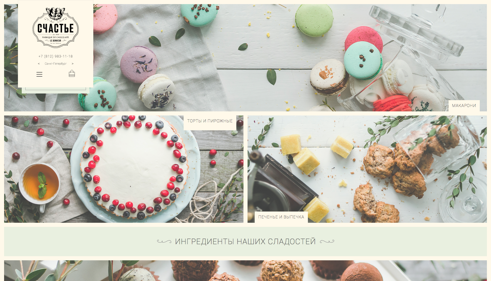

Лавка Счастья
=============

Вёрстка сайта [lavkaschastya.com](//lavkaschastya.com)

[Демо](//schastye.github.io/lavka-schastya-markup/)
---------------------------------------------------------

***

 Произведение «Вёрстка сайта „Лавка Счастья“» созданное автором по имени <a xmlns:cc="http://creativecommons.org/ns#" href="https://github.com/Realetive" property="cc:attributionName" rel="cc:attributionURL">Roman @Realetive Ganin</a>, публикуется на условиях <a rel="license" href="http://creativecommons.org/licenses/by-nc-nd/4.0/">лицензии Creative Commons «Attribution-NonCommercial-NoDerivatives» («Атрибуция — Некоммерческое использование — Без производных произведений») 4.0 Всемирная</a>.